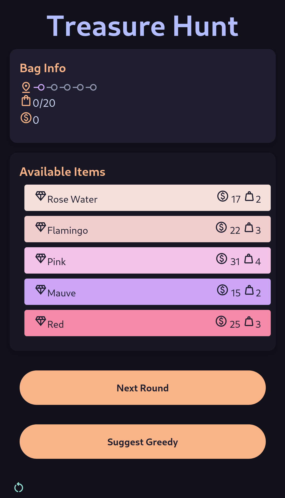

# Treasure Hunt: Greedy Approach vs. Dynamic Programming

[https://treasure-hunt-f92k.onrender.com](https://treasure-hunt-f92k.onrender.com)

## Overview

This project is an interactive web application developed as a presentation aid for our group on the topic **Greedy Algorigthms** for **Algorithmic Thinking with Python** course. It aims to illustrate the **Greedy Approach** in problem-solving and provide a basis for comparison with **Dynamic Programming** using a fun, treasure hunt-themed game. The core problem presented is a variation of the classic **Knapsack Problem**, where players must strategically choose diamonds to maximize their value within a given weight constraint.

## Screenshots



## Game Mechanics

- **Diamond Selection:** Players are presented with a list of diamonds, each with a specific value and weight, inspired by the color names of the Catppuccin Mocha color palette.
- **Greedy Choices:** The game emphasizes the greedy approach, meaning players cannot revisit previous rounds. Each decision must be made based on the current information.
- **Value/Weight Suggestion:** A helpful feature is included to suggest the optimal greedy choice based on the value-per-weight ratio of the available diamonds.
- **5 Rounds:** The game consists of 5 rounds of diamond picking, challenging players to make consistently good decisions.
- **Win Condition:** A winning message is displayed if the player successfully maximizes their treasure value within the constraints.

## Technologies Used

- ** Build Tool:** [Vite](https://vitejs.dev/)
- **Programming Language:** [TypeScript](https://www.typescriptlang.org/)
- **Styling:** [Tailwind CSS](https://tailwindcss.com/)
- **Color Scheme:** [Catppuccin Mocha](https://github.com/catppuccin/catppuccin) - Soothing pastel theme for the high-spirited!
- **Deployment:** [Render](https://render.com/) - The web application is hosted on Render for easy accessibility.

## Educational Value

This project serves as an engaging way to learn about:

- **Greedy Algorithms:** making locally optimal choices at each step.
- **Knapsack Problem:** Explore a classic optimization problem and its variations.

## Installation and Setup

To run this project locally:

1. **Clone the repository:**

   ```bash
   git clone https://github.com/dijith-481/treasure-hunt.git && cd treasure-hunt
   ```

2. **Install dependencies:**

   ```bash
   npm install
   ```

3. **Start the development server:**

   ```bash
   npm run dev
   ```

   This will open the application in your browser at `http://localhost:5173/` (or a different port if 5173 is in use).

## Acknowledgements

Catppuccin Mocha palette significantly contributes to the visual appeal and user experience of this project.

The diamond names within the game are inspired by the Catppuccin color names,
[catppuccin](https://github.com/catppuccin/catppuccin)
